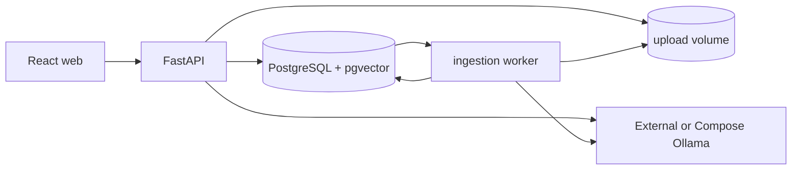

# AGENTS.md

## Project

**CiteNook** is the display name for the `cite-nook-ai` repository. It is a minimal local document question-answering application built with React, FastAPI, PostgreSQL/pgvector, a separate ingestion worker, and Ollama.

The goal is a small, complete vertical slice: upload a document, wait for indexing, ask a question, receive a grounded answer, and inspect the sources.

## Product principles

- Keep the application local and usable without accounts.
- Persist uploaded files, document state, conversations, messages, selected models, chunks, and citations on the backend.
- Use the official Ollama Python client for chat and embeddings.
- Keep one clear RAG path; do not add a framework solely to hide a small amount of application code.
- Return explicit sources with every grounded answer.
- If the retrieved sources are insufficient, say so rather than inventing an answer.
- Keep product branding in `packages/brand/brand.json`; technical database and `@citenook/*` package identifiers must remain stable during a rebrand.
- Treat Ollama as an external dependency by default. The optional Compose override may run it as a separate service, but the application images never install Ollama.
- Prefer a separate worker for extraction and embedding. The worker queue is PostgreSQL-backed to avoid another infrastructure service.

## Architecture



See `docs/architecture.md` and `docs/rag-pipeline.md`.

## Boundaries

- React components use `apps/web/src/api.ts`; they do not call Ollama or PostgreSQL.
- FastAPI routers validate HTTP input and delegate retrieval, ingestion, and model calls to services.
- `OllamaGateway` is the only Python boundary that imports and calls the Ollama client.
- The worker owns extraction, chunking, embedding, and document status transitions.
- Storage records and model prompts are separate contracts.
- A conversation stores the chat model and embedding model used for that conversation.
- A document stores the embedding model used for its chunks. Retrieval only compares compatible embeddings.

## Scope

Release 0.1 includes only:

- selectable configured chat and embedding models;
- persistent PDF, DOCX, TXT, and Markdown upload;
- queued/processing/ready/failed document states;
- a separate ingestion worker;
- pgvector retrieval;
- persistent conversations and messages;
- grounded answers with document/page references;
- document and conversation deletion;
- Docker Compose local startup with either an external Ollama instance or the optional Ollama service.

Do not add authentication, cloud sync, OCR, web crawling, reranking, hybrid search, agents, tool execution, streaming chat, or multi-tenant abstractions unless a later story explicitly introduces them.

## Codex workflow

Use only the smallest relevant workflow:

- `architect` for cross-cutting data/RAG/container changes;
- `implementation_worker` for a bounded implementation slice;
- `reviewer` for correctness, retrieval quality, persistence, tests, and unnecessary complexity.

Repository skills:

- `full-stack-delivery` — React/FastAPI/Turborepo/Docker changes;
- `rag-pipeline` — upload, worker, chunking, embeddings, pgvector, prompts, and citations;
- `release-evidence` — user-story status and verification evidence.

Do not invoke every agent or skill for small edits. Prefer one write-owning agent at a time.

## License headers

The repository uses Apache-2.0. New hand-authored, project-specific source files use:

```text
SPDX-FileCopyrightText: 2026 Keresztes Zsolt <https://kereszteszsolt.hu>
SPDX-License-Identifier: Apache-2.0
```

Keep the header at the beginning of those source files. Do not add it to standard or configuration files such as Dockerfiles, Compose YAML, TOML, ignore files, environment examples, JSON, Markdown, generated lock files, or binary assets.

## Verification

Before claiming a story is implemented, run the relevant checks:

```bash
npm run lint
npm run test
npm run build
docker compose config
docker compose -f docker-compose.yml -f docker-compose.ollama.yml config
```

For the complete path, also run the Docker smoke test described in `docs/testing.md` with a real Ollama chat model and embedding model installed.
