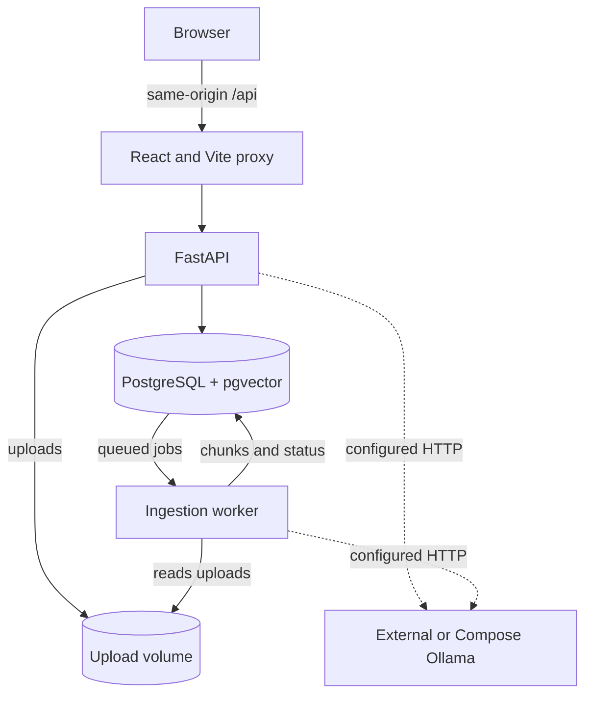

# CiteNook

**CiteNook AI** is a local-first document question-answering application that lets you upload files, ask grounded questions, and inspect the cited sources.

_Ask your documents. Verify the sources._

[](LICENSE)


<br>


## Highlights

- Upload and persist PDF, DOCX, TXT, and Markdown documents.
- Index documents asynchronously with a separate worker, Ollama embeddings, and PostgreSQL/pgvector.
- Keep conversations, messages, selected models, citations, and document state across restarts.
- Ask grounded questions and inspect the exact document, page, passage, and similarity score behind each cited source.
- Run locally without accounts, using either an existing Ollama instance or a dedicated Ollama service in the Compose stack.

CiteNook is developed through independently verifiable MRA stories. The [release story maps](#verification-references) document the path from the initial local RAG workflow to the current document and conversation experience.

## Screenshots

[](docs/screenshots/citenook-chat-desktop.png)

[Desktop chat](docs/screenshots/citenook-chat-desktop.png) · [New conversation](docs/screenshots/citenook-new-conversation-desktop.png) · [Document management](docs/screenshots/citenook-documents-desktop.png) · [Mobile chat](docs/screenshots/citenook-chat-mobile.png) · [Screenshot notes](docs/screenshots/README.md)

## Documentation

[User guide](docs/user-guide.md) · [Architecture](docs/architecture.md) · [RAG pipeline](docs/rag-pipeline.md) · [Development](docs/development.md) · [Testing](docs/testing.md) · [Technology stack](docs/technology-stack.md) · [Roadmap](docs/roadmap.md) · [Design handoff](docs/design/README.md) · [All documentation](docs/README.md)

## Architecture



See the [detailed architecture](docs/architecture.md) and [RAG pipeline](docs/rag-pipeline.md) documentation.

## Release 0.5 plan: one RAG backend per deployment

The current Release 0.4 code always starts the native CiteNook RAG path. The planned Release 0.5 keeps `native` as the default and adds `llamaindex` as a separate deploy choice. One API and worker pair will build one backend only; there will be no UI switch, dual indexing, dual retrieval, or silent fallback.

| Planned deployment | Backend that starts | Model runtime |
| --- | --- | --- |
| Base Compose | Native | External Ollama |
| Base + Ollama override | Native | Compose-managed Ollama |
| Base + LlamaIndex override | LlamaIndex | External Ollama |
| Base + LlamaIndex + Ollama overrides | LlamaIndex | Compose-managed Ollama |

The exact planned commands, data isolation rules, cleanup work, and story order are in the [Release 0.5 plan](docs/releases/release-0.5-clean-rag-backends/README.md). Those LlamaIndex commands become supported only after `MRA-026` is implemented and tested.

## Quick start

Create the local configuration file before the first start:

```bash
cp .env.example .env
```

Docker Compose automatically reads the repository-root `.env`. Edit that file to configure the Ollama endpoint, the available model names, and local ports. The file is ignored by Git and must not be committed. `.env.local` and `.env.dev` are not used by the supported Compose commands. Keep `VITE_API_URL=/api` for the supported same-origin browser route; Compose forwards it to `VITE_API_PROXY_TARGET=http://api:8000`.

Choose one of the following Ollama modes.

### Option A: use an existing Ollama instance (default)

Ollama is not installed in the API, worker, or web containers. By default the application connects to `http://host.docker.internal:11434`. Set `OLLAMA_HOST` in `.env` to use another URL that is reachable from Docker.

```bash
docker compose up --build
```

### Option B: run a dedicated Ollama instance for CiteNook

This optional override starts an official Ollama container dedicated to CiteNook as part of the same Compose stack. It keeps its models in a CiteNook-managed persistent volume while remaining isolated from the API, worker, and web containers:

```bash
docker compose -f docker-compose.yml -f docker-compose.ollama.yml up --build
```

The containerized Ollama API is exposed on `http://localhost:11435` by default so it can coexist with an external instance on port `11434`. Override `OLLAMA_CONTAINER_PORT` if needed.

Open CiteNook at `http://localhost:5173` or `http://127.0.0.1:5173`. Both loopback forms use the same-origin `/api` proxy. The API documentation remains available directly at `http://localhost:8000/docs`.

If the API cannot be reached during startup, the header reports `CiteNook API unavailable` and the error banner offers **Retry connection**. After the containers become ready, retrying reloads models, conversations, and documents without a browser refresh.

## Configure models

CiteNook displays the models listed in `CHAT_MODELS` and `EMBEDDING_MODELS`. Each conversation stores its selected chat and embedding model. Configured models that are not installed in Ollama remain visible but cannot be selected.

Install the default models in an existing Ollama instance with:

```bash
ollama pull llama3.1:8b
ollama pull qwen3-embedding:0.6b
```

When using the dedicated Compose service, install the models from another terminal with:

```bash
docker compose -f docker-compose.yml -f docker-compose.ollama.yml exec ollama ollama pull llama3.1:8b
docker compose -f docker-compose.yml -f docker-compose.ollama.yml exec ollama ollama pull qwen3-embedding:0.6b
```

Reload CiteNook after installing a model so the conversation dialogs refresh their installed status.

## Basic workflow

1. Open **Documents**, upload a PDF, DOCX, TXT, or Markdown file, and wait for it to become `ready`.
2. Create a conversation with an installed chat and embedding model.
3. Ask a question in **Chat** and inspect the cited document, page, passage, and similarity score below the answer.

Documents and conversations persist across restarts. Documents can be excluded from retrieval without deleting them, and conversations retain their selected models and complete message history. See the [user guide](docs/user-guide.md) for interface details and [`.env.example`](.env.example) for all runtime settings.

## Brand and technical identifiers

| Purpose | Value |
| --- | --- |
| Product name | `CiteNook` |
| Full product name | `CiteNook AI` |
| Repository | `cite-nook-ai` |
| Application ID | `cite-nook-ai` |
| npm package scope | `@citenook/*` |
| Docker Compose project | `citenook` |
| User story prefix | `MRA` |

Canonical brand metadata and shared technical identifiers are maintained in [`packages/brand/brand.json`](packages/brand/brand.json).

## Verification

Run the repository checks before submitting a change:

```bash
npm run lint
npm run test
npm run build
docker compose config
docker compose -f docker-compose.yml -f docker-compose.ollama.yml config
```

### Verification references

| Document | Contents |
| --- | --- |
| [Testing guide](docs/testing.md) | Automated checks, screenshot regeneration, and runtime smoke tests |
| [Release 0.1 story map](docs/releases/release-0.1-mini-rag/README.md) | Minimal local RAG |
| [Release 0.2 story map](docs/releases/release-0.2-focused-workspaces/README.md) | Focused workspaces |
| [Release 0.3 story map](docs/releases/release-0.3-conversation-model-workflows/README.md) | Conversation model workflows |
| [Release 0.4 story map](docs/releases/release-0.4-local-experience-polish/README.md) | Local experience polish |
| [Release 0.5 plan](docs/releases/release-0.5-clean-rag-backends/README.md) | Cleanup, architecture refactor, and selectable RAG backends |

## License

Apache License 2.0. See [`LICENSE`](LICENSE).

## Contact

**Project maintainer: Keresztes Zsolt**

| Platform | Link |
| --- | --- |
| Website | [kereszteszsolt.hu](https://kereszteszsolt.hu/) |
| GitHub | [@kereszteszsolt](https://github.com/kereszteszsolt) |

> The maintainer's website is available in Hungarian (HU), English (EN), Romanian (RO), and German (DE).

## ☕ Ways to support

**Explore ways to support the maintainer and their projects.**

[https://kereszteszsolt.hu/ways-to-support](https://kereszteszsolt.hu/ways-to-support)

<p align="center">
  <a href="https://buymeacoffee.com/kereszteszsolt"></a><br>
  <strong>Every coffee counts! ☕❤️</strong>
</p>

---

<p align="center">
  <strong>Made with ❤️ by <a href="https://kereszteszsolt.hu/">Keresztes Zsolt</a></strong><br>
  ⭐ Star this repository if you found it helpful!
</p>
