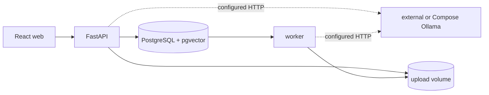

# Architecture

MRA-001 establishes the local runtime boundary. React talks only to FastAPI; the API and worker share PostgreSQL/pgvector and never install Ollama inside their images. MRA-002 keeps Ollama access behind the API gateway and stores each conversation's chat and embedding model in PostgreSQL. MRA-003 stores upload metadata in PostgreSQL and original bytes in the shared upload volume.

The default `docker-compose.yml` expects an external Ollama endpoint. `docker-compose.ollama.yml` adds Ollama as a separate service, redirects the application services to it, and exposes it on host port `11435` by default to avoid colliding with an existing external instance.

The web client reads the configured model catalog from FastAPI. FastAPI uses the official Ollama client only to discover which configured names are installed; configured but unavailable names remain part of the API response. Conversation creation and updates accept only configured names and persist both selections.

For uploads, the API reduces the supplied name to a safe base name, streams the body into a temporary file while enforcing the configured limit and calculating SHA-256, and atomically moves it to `<UPLOAD_DIR>/<document UUID>/<file name>`. Only after the final path exists does the database transaction commit the document and its queued ingestion job. The API and worker mount the same named upload volume.

Later MRA stories process queued jobs and add document management and messages without changing these boundaries.
