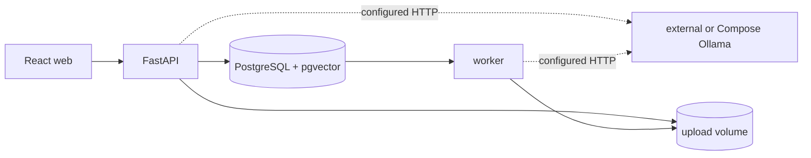

# Architecture

MRA-001 establishes the local runtime boundary. React talks only to FastAPI; the API and worker share PostgreSQL/pgvector and never install Ollama inside their images. MRA-002 keeps Ollama access behind the API gateway and stores each conversation's chat and embedding model in PostgreSQL. MRA-003 stores upload metadata in PostgreSQL and original bytes in the shared upload volume. MRA-004 processes those bytes in the separate worker and persists their chunks and embeddings. MRA-006 stores complete conversation histories and their answer provenance in PostgreSQL. MRA-007 completes the path with model-compatible pgvector retrieval and grounded Ollama chat. MRA-008 adds a global Documents workspace and a persistent per-document retrieval switch.

The default `docker-compose.yml` expects an external Ollama endpoint. `docker-compose.ollama.yml` adds Ollama as a separate service, redirects the application services to it, and exposes it on host port `11435` by default to avoid colliding with an existing external instance.

The web client reads the configured model catalog from FastAPI. FastAPI uses the official Ollama client only to discover which configured names are installed; configured but unavailable names remain part of the API response. Conversation creation and updates accept only configured names and persist both selections.

For uploads, the API reduces the supplied name to a safe base name, streams the body into a temporary file while enforcing the configured limit and calculating SHA-256, and atomically moves it to `<UPLOAD_DIR>/<document UUID>/<file name>`. Only after the final path exists does the database transaction commit the document and its queued ingestion job. The API and worker mount the same named upload volume.

The worker atomically claims one queued job at a time with `FOR UPDATE SKIP LOCKED`. It extracts one-based PDF pages or DOCX/TXT/Markdown text, creates deterministic overlapping chunks, and calls the official Ollama client in bounded batches. It then stores the chunk text, ordinal, optional page number, embedding model, and pgvector value in PostgreSQL before marking the document ready. A configurable age threshold returns abandoned processing jobs to the queue.

The document API lists persisted processing and active state and returns original files only from the configured upload root. `PATCH /api/documents/{id}` changes only whether retrieval may use the document; it does not remove bytes, chunks, or jobs and does not trigger ingestion. New and existing database volumes receive a non-null active column with a true default during idempotent startup initialization. Deletion first moves the document's UUID directory aside, commits the database cascade for its chunks and jobs, restores the directory if that commit fails, and removes the quarantined bytes after success. The web client polls this API only while queued or processing documents remain.

Conversation turns are written atomically after locking the conversation row. Every message has a stable ordinal; assistant messages also store the exact chat model and structured citation snapshot as JSONB. The first normalized question creates a deterministic title bounded to 80 characters without a title-generation model call. The API returns the full ordered history for reloads, while the model-input boundary selects only the most recent `CHAT_HISTORY_MESSAGES` records. Conversation deletion cascades to every message.

For each question, the API embeds normalized text with the conversation embedding model. A cosine-distance query joins chunks to documents, filters both stored model names to that same model, accepts only active `ready` documents, orders by distance and chunk UUID, and limits the result to `RAG_TOP_K`. The result order becomes deterministic `S1`, `S2`, and so on.

The system prompt treats source text as untrusted data, permits only the current sources, requires exact source markers, and mandates an explicit insufficiency sentence. Recent conversation messages are bounded context rather than evidence. `OllamaGateway` makes the one non-streaming official-client chat call with the conversation chat model. The API rejects missing or invented markers, persists only sources actually cited by the answer, and returns their document, page, chunk, snippet, and score fields. If retrieval returns no compatible source, it stores the explicit insufficiency answer without inventing a citation.
