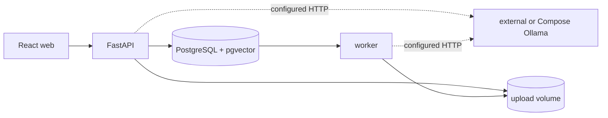

# Architecture

MRA-001 establishes the local runtime boundary. React talks only to FastAPI; the API and worker share PostgreSQL/pgvector and never install Ollama inside their images.

The default `docker-compose.yml` expects an external Ollama endpoint. `docker-compose.ollama.yml` adds Ollama as a separate service, redirects the application services to it, and exposes it on host port `11435` by default to avoid colliding with an existing external instance.

Later MRA stories add models and persistent entities without changing these boundaries.
