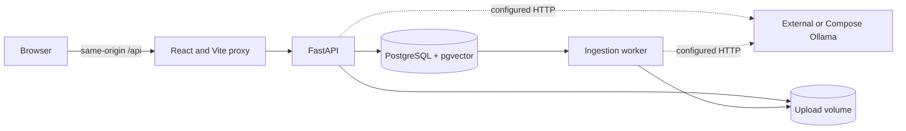
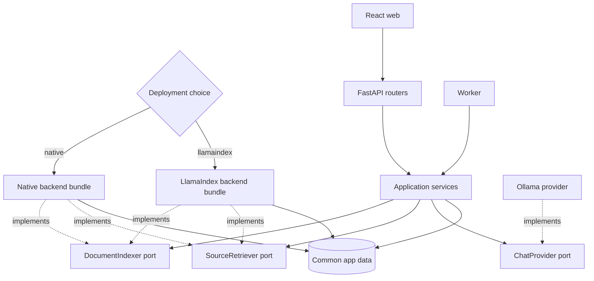
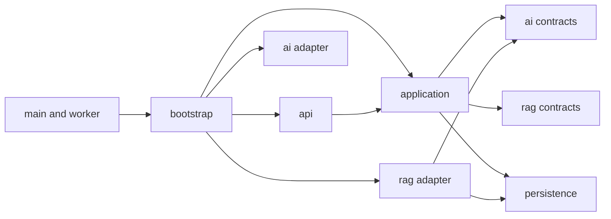
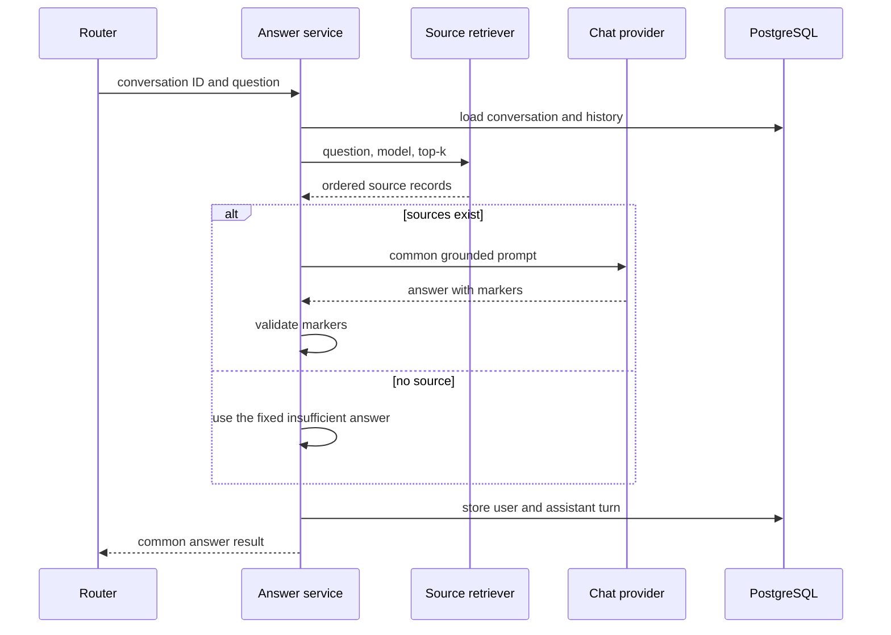
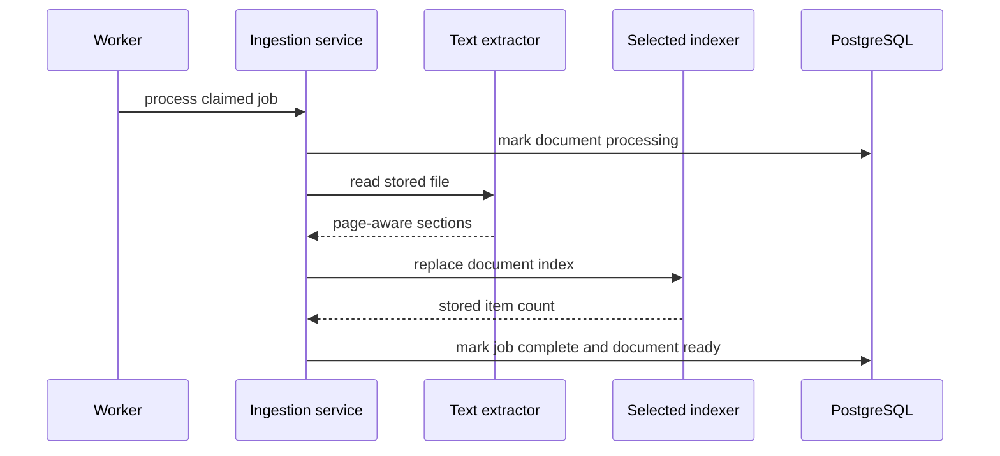
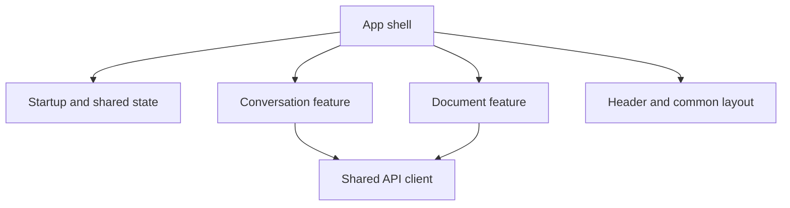

# Architecture

## Release 0.5 runtime

The browser calls FastAPI through the same-origin `/api` route. FastAPI and the worker share the selected Compose project's PostgreSQL/pgvector and upload volume. Ollama stays outside the application images.



The selected RAG backend is native by default. The LlamaIndex Compose override selects the optional adapter and its isolated data project. The API and worker always receive the same backend.

## Resulting boundaries

Release 0.5 separates these responsibilities:

- `App.tsx` owns startup, the active workspace, shared errors, and top-level layout.
- Conversation and document features own their state, requests, dialogs, views, and tests.
- The answer service owns the common prompt, chat, citation, timing, and message flow.
- The ingestion service owns job state and extraction, then calls the selected indexer.
- FastAPI and the worker receive concrete services from `app/bootstrap.py`.

Native and LlamaIndex implement the same small RAG ports. Common application code does not branch on the backend.

## Selected backend architecture

The public API and shared answer rules stay stable. A deployment builds one native or LlamaIndex backend.



A running API and worker pair receives the same backend bundle from the composition root. No request can select a backend.

## Python packages

```text
apps/api/app/
├── api/
│   ├── dependencies.py
│   ├── routers/
│   └── schemas.py
├── application/
│   ├── answers.py
│   ├── conversations.py
│   ├── documents.py
│   ├── extraction.py
│   ├── ingestion.py
│   ├── model_catalog.py
│   └── uploads.py
├── core/
│   ├── brand.py
│   └── settings.py
├── persistence/
│   ├── database.py
│   └── models.py
├── ai/
│   ├── contracts.py
│   └── ollama.py
├── rag/
│   ├── contracts.py
│   ├── native/
│   │   ├── chunking.py
│   │   ├── indexer.py
│   │   └── retriever.py
│   └── llamaindex/
│       ├── embedding.py
│       ├── indexer.py
│       ├── retriever.py
│       └── store.py
├── bootstrap.py
├── main.py
└── worker.py
```

The tree contains no compatibility package or empty forwarding layer.

## Package roles

| Package | Owns | Must not own |
| --- | --- | --- |
| `api` | HTTP validation, response models, status mapping | RAG queries, model calls, database workflow |
| `application` | Use-case order, transactions, job state, prompts, citations, storage flow | Concrete backend selection |
| `core` | Brand and validated settings | HTTP or RAG behavior |
| `persistence` | SQLAlchemy engine, sessions, ORM tables | Product use cases |
| `ai` | Model ports and Ollama adapter | RAG storage or answer policy |
| `rag` | Backend ports, source types, native and LlamaIndex adapters | HTTP responses or message persistence |
| `bootstrap` | Concrete dependency construction and backend choice | Product rules |

## Dependency direction



Rules:

- `core/settings.py` validates `RAG_BACKEND`, and `bootstrap.py` imports only the selected concrete backend for runtime setup.
- Routers receive app services from FastAPI dependencies.
- The worker receives its ingestion service from the same composition root.
- App services do not create settings, Ollama clients, indexers, or retrievers.
- Native modules do not import LlamaIndex.
- Common modules load successfully in the native image without LlamaIndex installed.
- A concrete adapter may use SQLAlchemy, but it does not return ORM rows across the port.

## Main ports

| Port | Input | Output | Owner |
| --- | --- | --- | --- |
| `ChatProvider` | model, chat messages, allowed source IDs | structured answer and source IDs | `ai` |
| `EmbeddingProvider` | model and one or more texts | vectors | `ai` |
| `ModelCatalogProvider` | none | installed and configured model data | `ai` |
| `DocumentIndexer` | session, document, extracted sections | stored item count | `rag` |
| `DocumentIndexer.delete_document` | session and document ID | none | `rag` |
| `SourceRetriever` | session, question, embedding model, top-k | ordered sources | `rag` |

The source record is backend neutral. It keeps the current citation fields, including the public `chunk_id` name. The LlamaIndex backend maps that field to a stable node UUID.

## Shared answer flow



Both retrievers enter this flow. LlamaIndex does not add its own query engine, prompt, chat call, or message write.

## Shared ingestion flow



The app service keeps state changes and bounded errors. The selected indexer owns chunk or node creation, embedding calls, vector writes, replacement, and index delete work.

## Native backend

The native indexer keeps the current deterministic character chunker and embedding batches. It writes `document_chunks` through SQLAlchemy. The native retriever embeds the question and orders compatible rows by pgvector cosine distance.

Release 0.4 data remains valid for this path. The native adapter is a refactor of the current code, not a new algorithm.

## LlamaIndex backend

The LlamaIndex indexer receives common extracted sections and creates page-aware nodes. It uses a small bridge to call the selected `EmbeddingProvider`, then stores JSONB metadata and vectors in the `citenook_llamaindex` PostgreSQL schema. Tables are separated by embedding model and vector dimension.

The LlamaIndex retriever uses the persistent LlamaIndex retrieval API. It filters by eligible document IDs and embedding model, maps nodes to the common source record, and gives equal scores a stable order.

The common `documents` table remains the source of truth for job state, active state, file metadata, and model identity.

## Data and deployment rules

- One database belongs to one RAG backend.
- Base Compose uses native and keeps Release 0.4 data compatible.
- The supported LlamaIndex override uses a different Compose project and separate volumes.
- A small database marker stores the selected backend and stops unsafe reuse.
- Switching a setting is not a data migration.
- Release 0.5 does not copy native chunks into LlamaIndex nodes or the reverse.
- Original uploads remain common app data inside each deployment.

## Frontend boundaries



The shell owns active workspace and app-wide startup state. Each feature owns its requests, state, dialogs, views, and focused tests. No new router or global state library is needed.

## Story ownership

| Change | Story |
| --- | --- |
| Old story and proof cleanup | `MRA-018` |
| Source comment cleanup and guard | `MRA-019` |
| Web feature split | `MRA-020` |
| Python package move | `MRA-021` |
| Composition root and model ports | `MRA-022` |
| Native RAG ports and adapters | `MRA-023` |
| LlamaIndex indexer | `MRA-024` |
| LlamaIndex retriever | `MRA-025` |
| Build and deploy choice | `MRA-026` |
| Final docs and proof | `MRA-027` |

See the [complete Release 0.5 plan](releases/release-0.5-clean-rag-backends/README.md).
