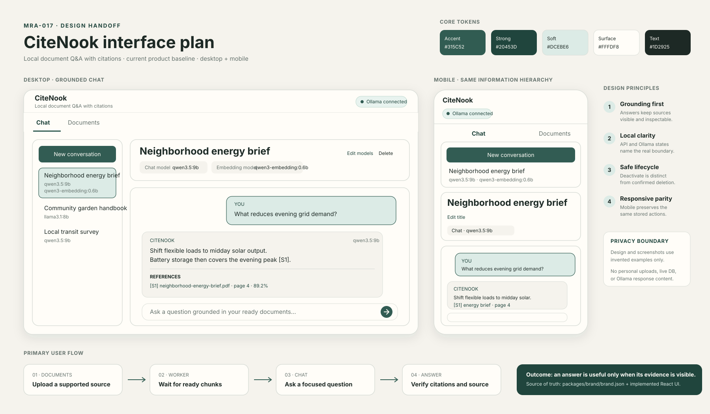

# CiteNook interface design handoff

The checked [interface design plan](citenook-interface-plan.svg) records the current CiteNook product baseline as a portable vector board. A [Chromium-rendered PNG](citenook-interface-plan.png) keeps the repository source easy to preview, while a separate [Penpot-origin PNG](citenook-interface-plan.penpot.png) records the synchronized design-board export. The board combines the desktop grounded-chat hierarchy, the responsive mobile hierarchy, central brand tokens, the primary user flow, and the privacy boundary used by project imagery.

## Source contracts

- Product name and colors: `packages/brand/brand.json`
- Implemented interface: `apps/web/src`
- Visual implementation evidence: `docs/screenshots`
- User workflow: `docs/user-guide.md`

## Penpot target

- Team: `9080f45a-69d5-801b-8008-5645e5939d3f`
- Project: `f0a77847-b187-8122-8008-868c5a188f29`
- File: `f0a77847-b187-8122-8008-868c7dc025ca`
- Page: `f0a77847-b187-8122-8008-868c7dc025cb`
- Board: `MRA-017 · CiteNook interface plan`
- Board ID: `5cc6ef41-e335-8023-8008-8692985e4d8d`

The SVG remains the portable repository source and is reviewable without a running design service. The distinct `.penpot.png` file was exported from the named board after synchronization through the connected Penpot MCP plugin. Penpot's SVG importer did not render the two decorative drop-shadow filters, so the synchronized board omits those shadows while preserving all documented content and hierarchy.
