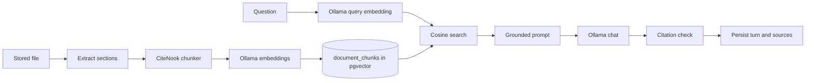
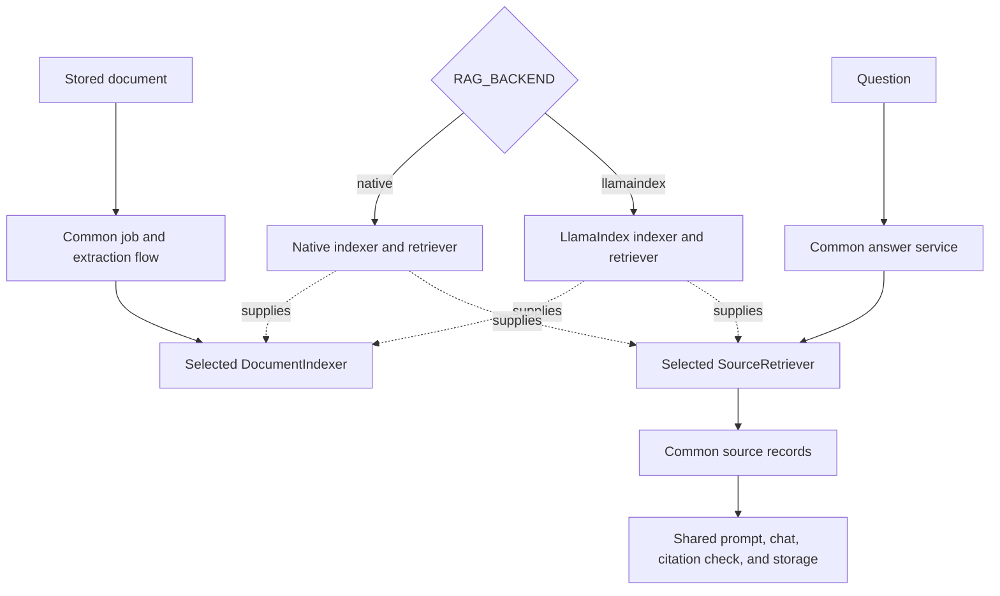

# RAG pipeline

## Current native flow through Release 0.4



The flow is complete and working. Release 0.5 keeps it as the default native backend while it moves the index and retrieval parts behind ports.

## Release 0.5 selected flow



Only one backend is built for a deployment. The UI and HTTP API do not choose it.

## Common ingestion work

The worker and application service keep these steps:

1. Claim one queued job.
2. Mark the job and document as processing.
3. Read the original file from the upload volume.
4. Extract page-aware text sections.
5. Call the selected `DocumentIndexer`.
6. Mark the document ready with the stored item count.
7. Store a short failure message when a step fails.

The backend owns the index-specific steps after extraction.

## Native indexing

```text
sections
→ current deterministic character chunks
→ embedding batches through EmbeddingProvider
→ replace document_chunks rows
→ return chunk count
```

This path keeps the current chunk sizes, overlap, page values, embedding model fields, and vector data.

## LlamaIndex indexing

```text
sections
→ page-aware LlamaIndex nodes
→ embeddings through a CiteNook provider bridge
→ persistent PostgreSQL vector store
→ return node count
```

Node IDs are stable UUIDs. Node metadata keeps document ID, file name, page, order, and embedding model. Repeated index and delete work must be safe.

## Common answer work

The answer service keeps these steps:

1. Normalize the question and load the conversation.
2. Ask the selected retriever for ordered source records.
3. Load the recent conversation history.
4. Build the same grounded prompt for either backend.
5. Call the selected chat provider.
6. reject missing or invalid source markers.
7. Store the question, answer, source JSON, model name, and response time.

When retrieval returns no source, the service uses the existing fixed insufficient-source answer.

## Native retrieval

```text
question
→ query embedding through EmbeddingProvider
→ ready + active + matching-model pgvector query
→ score mapping and stable order
→ common source records
```

## LlamaIndex retrieval

```text
question
→ eligible document IDs from common app data
→ LlamaIndex retriever with document and model filters
→ node score and metadata mapping
→ stable tie order
→ common source records
```

LlamaIndex is used for retrieval, not for final response synthesis in Release 0.5.

## Citation contract

Both paths return:

- `source_id`, assigned as `S1`, `S2`, and so on after stable ordering;
- `document_id` and `document_name`;
- optional `page_number`;
- stable `chunk_id`, which may name a native chunk or LlamaIndex node;
- exact `snippet` text;
- a numeric similarity `score`.

The answer may cite only markers supplied in the current prompt. Conversation history is context, not proof.

## Model compatibility

A document index is tied to its embedding model. Retrieval uses the conversation embedding model and must not mix incompatible vectors. Different vector sizes must stay in compatible backend storage.

## Delete contract

A document delete clears the selected index before the common document row and original file are removed. If index cleanup fails, the common record remains so the operation can be retried.

## Deployment contract

`native` is the default. `llamaindex` is selected by its Compose override. The Ollama mode is a separate choice, so either backend can use an external Ollama server or the optional Compose service.

See the [Release 0.5 implementation plan](releases/release-0.5-clean-rag-backends/implementation-plan.md) for the exact planned flow.
