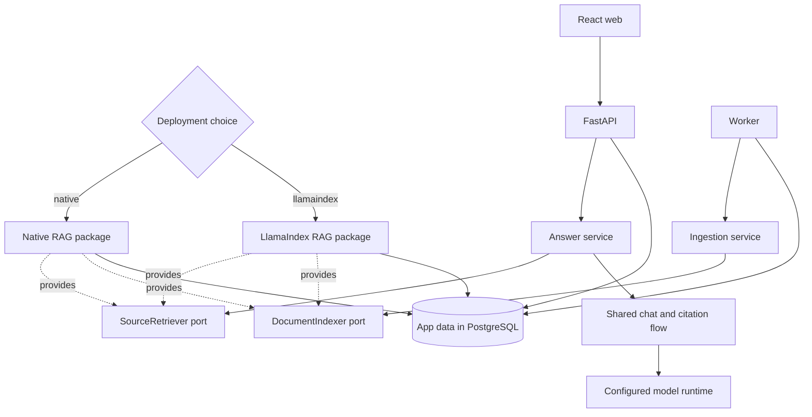

# Release 0.5: Clean architecture and selectable RAG backends

## Status

Planned. This folder is a delivery plan, not a claim that Release 0.5 is implemented.

## Objective

Clean the current story records, source comments, web structure, and Python structure. Keep the existing native RAG path working. Add a LlamaIndex path behind the same application rules, then select exactly one path when the app is deployed.

## Fixed design choices

- `native` stays the default RAG backend.
- `llamaindex` is a separate deployment choice.
- One API and worker pair uses one backend.
- The web UI has no backend switch.
- The app never writes to or searches both indexes for one request.
- Text extraction, job state, answer prompts, chat, citation checks, and message storage stay in CiteNook.
- Each backend owns its chunk or node work, embeddings for retrieval, vector storage, and source search.
- LlamaIndex retrieval returns sources to the common answer service; it does not own a second answer path.
- Release 0.4 data remains supported by the native deployment.
- A LlamaIndex deployment uses isolated data and builds its own index.

## Story map

| Order | Story | Title | Main result | Status |
| ---: | --- | --- | --- | --- |
| 1 | [MRA-018](stories/MRA-018-clean-historical-story-records.md) | Clean the historical story records | Short old stories and release-level proof | Implemented |
| 2 | [MRA-019](stories/MRA-019-enforce-short-source-comments.md) | Enforce short source comments | Clean comments and a lasting guard | Implemented |
| 3 | [MRA-020](stories/MRA-020-split-the-web-app-by-feature.md) | Split the web app by feature | Small app shell and focused feature modules | Implemented |
| 4 | [MRA-021](stories/MRA-021-reorganize-the-python-packages.md) | Reorganize the Python packages | Clear final package roles | Implemented |
| 5 | [MRA-022](stories/MRA-022-add-app-composition-and-model-ports.md) | Add app composition and model ports | Explicit dependencies and one composition root | Implemented |
| 6 | [MRA-023](stories/MRA-023-move-the-native-rag-path-behind-ports.md) | Move the native RAG path behind ports | Existing RAG as the native adapter | Implemented |
| 7 | [MRA-024](stories/MRA-024-add-persistent-llamaindex-indexing.md) | Add persistent LlamaIndex indexing | Durable LlamaIndex nodes in PostgreSQL | Implemented |
| 8 | [MRA-025](stories/MRA-025-add-llamaindex-source-retrieval.md) | Add LlamaIndex source retrieval | Common answers over LlamaIndex sources | Planned |
| 9 | [MRA-026](stories/MRA-026-deploy-one-rag-backend.md) | Deploy one RAG backend | Native or LlamaIndex at deploy time | Planned |
| 10 | [MRA-027](stories/MRA-027-complete-release-guides-and-diagrams.md) | Complete the release guides and diagrams | Final, tested, linked documentation | Planned |

## Delivery order and approvals

Stories are completed in the listed order. Codex works through the acceptance criteria in order and does not skip an unchecked item. Before work starts on a story, Codex names the scope, likely files, and checks, then asks for approval. After the work and checks are shown, Codex asks for separate commit approval. After an approved commit, Codex reports the hash and asks whether it may start the next valid story.

The full rules are in the [story workflow](../../story-workflow.md).

## Release plans

- [Cleanup plan](cleanup-plan.md) records the old story, comment, frontend, and Python cleanup.
- [Implementation plan](implementation-plan.md) records package moves, contracts, data flow, deploy choices, risks, and tests.
- [Verification plan](verification.md) is the release evidence table that will be filled as stories are completed.
- [Plan manifest](plan-manifest.md) states what this archive changes and what remains deferred.

## Target runtime

The diagram shows two valid builds. A running deployment constructs one backend only.

## Planned deploy contract

Release 0.4 always starts the native path. `MRA-026` will add the following Release 0.5 contract.

| RAG backend | Model runtime | Planned command shape |
| --- | --- | --- |
| Native | External Ollama | `docker compose up --build` |
| Native | Compose Ollama | `docker compose -f docker-compose.yml -f docker-compose.ollama.yml up --build` |
| LlamaIndex | External Ollama | `docker compose -f docker-compose.yml -f docker-compose.llamaindex.yml up --build` |
| LlamaIndex | Compose Ollama | `docker compose -f docker-compose.yml -f docker-compose.llamaindex.yml -f docker-compose.ollama.yml up --build` |

The final command names may change only if implementation tests show a clear need. The root README will show the tested commands after `MRA-026` passes.

## Release boundary

Release 0.5 does not add Ragas, cloud model providers, backend quality scoring, hybrid search, reranking, a runtime backend switch, or indexed-data migration. It does not add a third LlamaIndex path for evaluation.

## Next planned release

Release 0.6 remains a separate evaluation release. It will run the same documents and questions against the two real deployments, one deployment at a time. See the [roadmap](../../roadmap.md).
