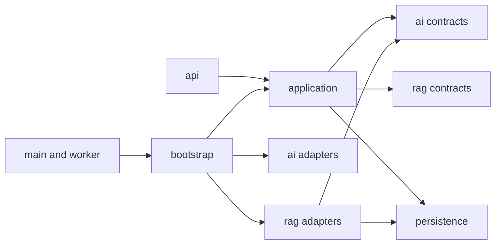

# Release 0.5 cleanup plan

## Purpose

The cleanup is part of the release, not a side task. It removes old documentation noise, blocks long generated comments, and moves current code into clear feature and package boundaries before LlamaIndex is added.

## Baseline audit

This plan is based on the Release 0.4 `develop` snapshot supplied on 2026-08-30.

| Area | Current state | Planned result |
| --- | --- | --- |
| Historical stories | 17 implemented stories; 14 contain issue or limitation sections | All 17 use the same short format with release-level proof |
| Story proof | Long commands, totals, and environment notes live inside story files | Detailed proof lives in one `verification.md` per release |
| Story verifier | It expects exactly 17 stories | It validates a continuous ID range with no fixed total |
| Source comments | Few prose comments exist, but no rule stops long AI-generated blocks | Short why-only comments with a repository check |
| Web shell | `App.tsx` is 614 lines and owns most feature state and actions | A small shell plus conversation and document feature modules |
| Web tests | `App.test.tsx` is 979 lines | Focused startup, conversation, and document suites |
| Answer service | Embedding, retrieval, prompt, chat, citations, timing, and storage share one service | Retrieval is a port; answer rules stay in the app service |
| Ingestion service | Job work, extraction, chunking, embedding, and vector writes share one service | Index work is a port; job state stays in the app service |
| Dependency setup | Routers and worker build concrete services in many places | One composition root builds shared services and adapters |
| Python folders | HTTP, settings, ORM, providers, and use cases sit near the package root | Clear `api`, `application`, `core`, `persistence`, `ai`, and `rag` roles |

Line counts are a baseline, not a permanent quality rule. The acceptance criteria focus on ownership and dependency direction rather than gaming file size.

## Historical story cleanup

`MRA-018` changes only release records and their verifier.

### Target story shape

Each story will keep these sections:

1. `Status`
2. `User story`
3. `Goal`
4. `Dependencies`
5. `Acceptance criteria`
6. `Out of scope`

Implemented stories keep checked criteria. Long proof moves to `docs/releases/<release>/verification.md`, where each story has a short linked entry.

### Treatment of old notes

Each removed issue or limitation note is handled once:

- Delete it when it is stale, resolved, or only records a local tool problem.
- Move factual test context to the release verification file when it is still needed to understand the proof.
- Move real future work to the roadmap when it is still useful and not yet planned.
- Do not change a past story to claim work that did not ship.

The cleanup does not rewrite project history. It makes the history easier to read.

## Source comment cleanup

`MRA-019` reviews hand-written Python, TypeScript, TSX, and repository scripts. Generated lock files and third-party content are excluded.

### Comment rules

- Add a comment only when the reason cannot be made clear by names or structure.
- Explain why a choice exists; do not narrate the next line of code.
- Prefer one short sentence.
- Use at most three short sentences in one comment block.
- Use at most five short sentences in a docstring.
- Keep design history, story text, plans, and test logs in Markdown docs.
- Keep required SPDX headers and tool directives unchanged.

The automated check will ignore license headers, `noqa`, `type: ignore`, test environment pragmas, and similar tool syntax. It will inspect normal prose comments and docstrings. The reviewer still checks meaning because a script cannot judge whether a note is useful.

## Web cleanup

`MRA-020` keeps the UI and API contract stable while it changes code ownership.

### Target web tree

```text
apps/web/src/
├── App.tsx
├── api.ts
├── types.ts
├── components/
│   └── Header.tsx
├── features/
│   ├── conversations/
│   │   ├── ConversationWorkspace.tsx
│   │   ├── useConversations.ts
│   │   ├── components/
│   │   └── tests/
│   └── documents/
│       ├── DocumentsWorkspace.tsx
│       ├── useDocuments.ts
│       ├── components/
│       └── tests/
└── test/
    └── startup.test.tsx
```

The exact file count may stay small. A folder should exist only when it owns real state, behavior, or tests.

### Web ownership rules

- `App.tsx` owns the app shell, active workspace, initial coordination, and shared error state.
- The conversation hook owns conversation load, selection, messages, create, rename, model change, delete, ask, and retry.
- The document hook owns load, polling, upload, active state, delete, and file-open data.
- Feature work calls `api.ts`; it does not call `fetch` directly.
- Shared components do not own feature requests.
- Existing accessibility, modal, desktop, and mobile behavior must remain.

## Python cleanup

`MRA-021` and `MRA-022` create the final package roles and dependency setup before a second RAG backend is added.

### Target Python tree

```text
apps/api/app/
├── api/
│   ├── dependencies.py
│   ├── routers/
│   └── schemas.py
├── application/
│   ├── answers.py
│   ├── conversations.py
│   ├── documents.py
│   ├── extraction.py
│   ├── ingestion.py
│   ├── model_catalog.py
│   └── uploads.py
├── core/
│   ├── brand.py
│   └── settings.py
├── persistence/
│   ├── database.py
│   └── models.py
├── ai/
│   ├── contracts.py
│   └── ollama.py
├── rag/
│   ├── contracts.py
│   ├── types.py
│   ├── native/
│   │   ├── chunking.py
│   │   ├── indexer.py
│   │   └── retriever.py
│   └── llamaindex/
│       ├── embedding.py
│       ├── indexer.py
│       ├── retriever.py
│       └── store.py
├── bootstrap.py
├── main.py
└── worker.py
```

This is a target map, not a request for empty wrappers. Related small files may be combined when one file is clearer.

### Dependency direction



Only `bootstrap.py` may choose a concrete RAG backend. Application services depend on ports. Native code does not import LlamaIndex, and common code does not import a concrete backend.

### Old-code refactor rules

- Move the existing code; do not copy it and leave a second live path.
- Remove old imports and empty compatibility files in the same story.
- Preserve HTTP shapes, table names, status values, citations, and file paths unless a story says otherwise.
- Keep transactions and failure behavior visible in app services.
- Keep direct database code where it is small; do not add a repository class for every table.
- Add a boundary only when it lets the two RAG paths or future model providers share a stable app contract.

## Cleanup completion rule

The cleanup is done only when the old path is removed, tests use the new paths, and the docs match the final ownership. A new folder alone is not an architecture improvement.
