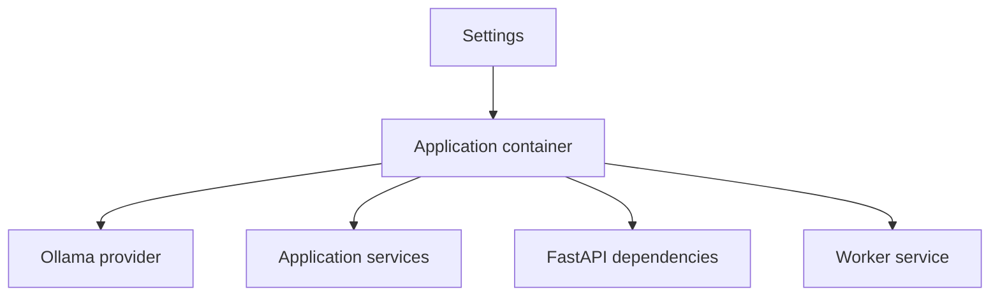
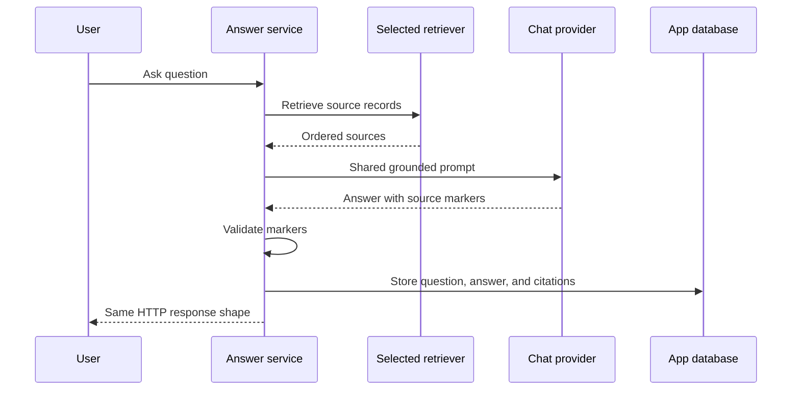

# Release 0.5 implementation plan

## Delivery method

Codex implements one approved story at a time. It works through that story's acceptance criteria in order, runs focused checks, shows the result, and asks for commit approval. A later story may not start until the prior story has an approved commit or the user changes the plan.

## Story execution matrix

| Story | Depends on | Main write area | Focused proof before commit |
| --- | --- | --- | --- |
| `MRA-018` | — | Old story files, old release maps, release verification files, verifier | Story audit, reading score, heading ban, local links |
| `MRA-019` | `MRA-018` | Source comments, agent rules, verifier | Comment audit, lint, tests, build |
| `MRA-020` | `MRA-019` | `apps/web/src` | Focused web tests, full web tests, build, screenshot review |
| `MRA-021` | `MRA-019` | `apps/api/app` package paths and tests | Ruff, Python tests, import compile, API smoke |
| `MRA-022` | `MRA-021` | Model contracts, Ollama adapter, bootstrap, API dependencies, worker | Fake-provider tests, API tests, worker tests, import check |
| `MRA-023` | `MRA-022` | RAG contracts, native adapters, app services, delete flow | Native index, retrieval, answer, delete, and Release 0.4 data tests |
| `MRA-024` | `MRA-023` | Optional dependencies and LlamaIndex index adapter | Lock check, node tests, PostgreSQL write, replace, delete, failure test |
| `MRA-025` | `MRA-024` | LlamaIndex retriever and common source mapping | Filter, order, score, citation, and no-result tests |
| `MRA-026` | `MRA-025` | Settings, metadata marker, Dockerfile, Compose, health | Four Compose configs, two image checks, four runtime smoke paths |
| `MRA-027` | `MRA-018`–`MRA-026` | README, docs, diagrams, release proof | Link audit, repository audit, full lint, test, build, and smoke results |

Each row is one commit boundary unless the user approves another split. A story may not borrow scope from a later row just to make its current implementation easier.

## Phase 1: clean the rules and current code

### MRA-018: historical story records

Expected files:

- `docs/releases/release-0.1-*/stories/*.md`
- `docs/releases/release-0.2-*/stories/*.md`
- `docs/releases/release-0.3-*/stories/*.md`
- `docs/releases/release-0.4-*/stories/*.md`
- one `verification.md` in each old release
- old release maps
- `docs/story-workflow.md`
- repository verifier

Key checks:

- all story IDs remain present and unique;
- all implemented criteria stay checked;
- no story contains an issue or limitation section;
- strict format and reading checks pass for all stories;
- local release links resolve.

### MRA-019: source comments

Expected files:

- hand-written source files that contain prose comments or docstrings;
- `AGENTS.md` and Codex guidance;
- repository verifier and its focused tests, if added.

Required exclusions:

- SPDX headers;
- shebangs;
- `noqa`, `type: ignore`, and lint directives;
- test environment directives;
- generated and third-party files.

The check should report the file and line for each violation. It should not rewrite comments by itself.

### MRA-020: web feature split

Migration order:

1. Extract conversation state and actions into a hook.
2. Move conversation views and dialogs under the feature.
3. Extract document state, polling, and actions into a hook.
4. Move document views under the feature.
5. Reduce `App.tsx` to shell work.
6. Split tests and run screenshot checks.
7. Delete the old component paths after imports are clean.

No visible behavior should change in this story.

## Phase 2: clean the Python architecture

### MRA-021: package roles

The move should happen in small import-safe steps. Tests must pass at the end of the story, and no duplicate live modules may remain.

| Current location | Target role |
| --- | --- |
| `routers/`, `schemas.py`, `dependencies.py` | `api/` |
| `services/answers.py` and other use cases | `application/` |
| `services/extraction.py` | `application/extraction.py` |
| `brand.py`, `settings.py` | `core/` |
| `database.py`, `models.py` | `persistence/` |
| `ollama_gateway.py` | `ai/ollama.py` |
| `services/chunking.py` | `rag/native/chunking.py` |

`main.py` and `worker.py` remain entry points at the package root. Table names and JSON contracts must not change as a side effect of file moves.

### MRA-022: composition and model ports

Target model contracts:

```text
ChatProvider.chat(model, messages) -> str
EmbeddingProvider.embed(model, input) -> list[list[float]]
ModelCatalogProvider.list_models() -> model names and availability
```

One `OllamaProvider` may implement all three contracts. App services receive only the contract they need.

Target composition flow:



`get_settings()` is called in the composition layer, not inside each service. Tests construct services with fakes and do not patch global clients when direct injection is enough.

## Phase 3: expose the native RAG backend

### Port shapes

The final names may be adjusted for Python style, but the responsibilities stay fixed.

```text
DocumentIndexer.replace_document(session, document, sections) -> item count
DocumentIndexer.delete_document(session, document_id) -> None
SourceRetriever.retrieve(session, question, embedding_model, top_k) -> sources
```

The source result keeps the public citation fields:

```text
source_id
document_id
document_name
page_number
chunk_id
snippet
score
```

For the LlamaIndex path, `chunk_id` remains the public compatibility name for a stable node UUID.

### Native ownership

The native indexer receives extracted sections, runs the current deterministic chunker, embeds in batches, replaces `document_chunks`, and returns the count. The native retriever embeds the question, runs the current cosine query, and maps rows to the common source type.

The application services keep these tasks:

| Service | Retained work |
| --- | --- |
| Ingestion | Claim job, set state, extract text, call indexer, store final state, bound errors |
| Answer | Load chat, call retriever, build prompt, call chat, validate markers, measure time, store turn |
| Document | List, activate, find file, call index delete, remove app record and file |

This split must replace the old inline work. It must not leave a hidden second native path.

## Phase 4: add LlamaIndex as a real backend

### LlamaIndex boundary

LlamaIndex owns node splitting, embedding calls through a small bridge, persistent vector writes, delete, and retrieval. CiteNook owns files, extraction, jobs, documents, active state, conversations, prompts, chat, citations, and API output.

Official LlamaIndex PostgreSQL vector storage and retrieval APIs should be used. Exact package versions are chosen and locked during `MRA-024` after Python 3.13 and 3.14 compatibility checks.

### Node identity and metadata

Each node gets a deterministic UUID derived from the document ID and node order. Repeating the same index job must replace the same logical nodes rather than create duplicates.

Required metadata:

| Field | Use |
| --- | --- |
| `document_id` | Join the node to common document state |
| `document_name` | Build the citation without another file lookup |
| `page_number` | Preserve page proof when known |
| `ordinal` | Give a stable tie order |
| `embedding_model` | Prevent model mixing |
| `node_id` | Expose a stable citation item ID |

The node text is stored by the vector store so retrieved sources can return the exact passage.

### Active and model filters

The common `documents` table remains the source of truth for `ready`, `is_active`, and `embedding_model`. Before LlamaIndex retrieval, the adapter gets the eligible document IDs for the conversation model and applies them as metadata filters. If no document is eligible, it returns an empty list without a model call.

### Write and delete safety

LlamaIndex vector writes may use a connection outside the SQLAlchemy app transaction. The adapter must therefore use explicit steps:

1. Delete old nodes for the document.
2. Build and store the new nodes.
3. Return the stored count.
4. Mark the common document ready only after the adapter succeeds.
5. On failure, make a best-effort node cleanup and mark the job failed.

Deleting a document first clears its selected index. If index cleanup fails, the API keeps the common record and original file so the delete can be retried.

### Answer flow



There is no LlamaIndex query engine in this release. This keeps generation and citation behavior equal across both backends.

## Phase 5: deployment selection

### Setting and build targets

`RAG_BACKEND` has two valid values:

```text
native
llamaindex
```

The default is `native`. Invalid values stop startup with a clear error.

The API Dockerfile should use shared base stages and two final targets:

```text
runtime-native
runtime-llamaindex
```

The native target installs the common project only. The LlamaIndex target installs the locked optional LlamaIndex extra. A native import smoke test proves that common startup does not import LlamaIndex.

### Compose selection

The base Compose file uses `runtime-native` and `RAG_BACKEND=native`. A `docker-compose.llamaindex.yml` override selects `runtime-llamaindex`, sets `RAG_BACKEND=llamaindex` for API and worker, and uses a separate Compose project name.

The existing Ollama override stays independent. This gives four supported combinations without adding four full Compose files.

### Data ownership marker

A small app metadata record stores the RAG backend that owns the database.

- A new empty database records the selected backend.
- A Release 0.4 database with existing native chunks may adopt `native` once.
- A Release 0.4 database may not start as `llamaindex` while native indexed data exists.
- A marked database stops startup when the selected backend differs.

The supported LlamaIndex command uses separate volumes, so a normal user does not see this error. The marker protects manual database reuse.

### Health and logs

`GET /api/health` adds a `ragBackend` field. API startup and worker startup log the selected backend once. The web UI does not need to display or choose it.

## Phase 6: final documentation and proof

`MRA-027` changes planned text into tested instructions. It must update:

- root `README.md`;
- `docs/architecture.md`;
- `docs/rag-pipeline.md`;
- `docs/development.md`;
- `docs/testing.md`;
- `docs/technology-stack.md`;
- `docs/story-workflow.md`;
- `docs/roadmap.md`;
- all repository agent and skill instructions;
- the Release 0.5 story map and verification file.

The final README must state which backend each deploy command starts. It must not imply that both indexes run together.

## Test matrix

| Area | Native | LlamaIndex |
| --- | --- | --- |
| Unit tests with fake model provider | Required | Required |
| PostgreSQL index integration | Existing chunk table | LlamaIndex vector table |
| Upload and worker job | Required | Required |
| Active document filter | Required | Required |
| Embedding model filter | Required | Required |
| Grounded answer and citation | Required | Required |
| Document delete and retry | Required | Required |
| API restart with saved data | Required | Required |
| External Ollama Compose config | Required | Required |
| Compose-managed Ollama smoke | Required | Required |
| Native image without LlamaIndex import | Required | Not applicable |
| Wrong database backend marker | Required | Required |

Full end-to-end smoke tests run each backend in isolation. They use a dedicated document and conversation, then remove only that test data.

## Rollback rule

Each story must leave the repository runnable. If a story cannot meet its criteria, it stays uncommitted unless the user approves a smaller recovery commit. No story may keep both old and new live paths as a fallback.
