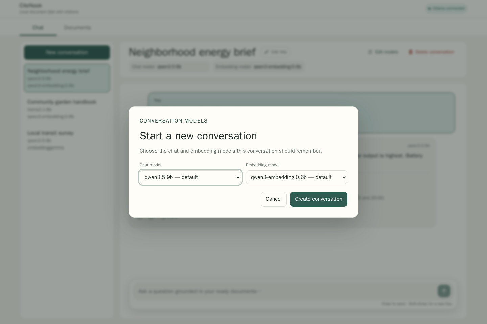

# CiteNook screenshots

These screenshots are generated from the real React application with static, invented Playwright API fixtures. The capture workflow does not connect to PostgreSQL, Ollama, the Compose upload volume, or the currently running CiteNook instance, so personal documents and conversations cannot enter the images.

## Gallery

### Grounded chat on desktop

### New conversation on desktop

### Stored document management

### Grounded chat on mobile

## Regeneration

Run `npm run screenshots` in a development environment with the pinned Playwright dependency and Chromium available. The WSL-compatible container command and privacy boundary are documented in [the testing guide](../testing.md#product-screenshots).

The source fixture is `apps/web/e2e/demo-screenshots.e2e.ts`. Keep it generic and inspect every regenerated image before committing it.
