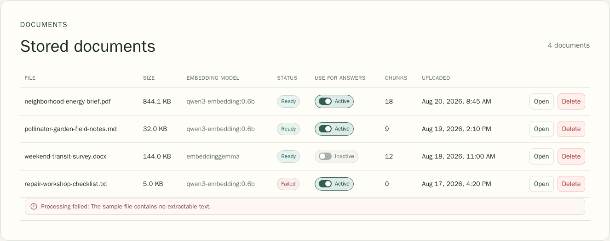
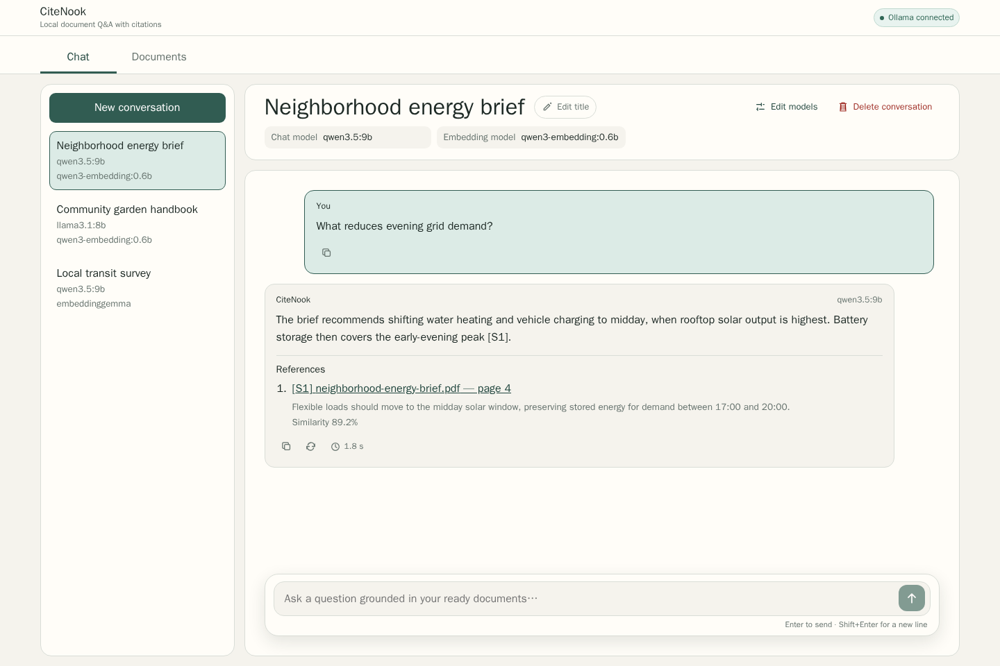
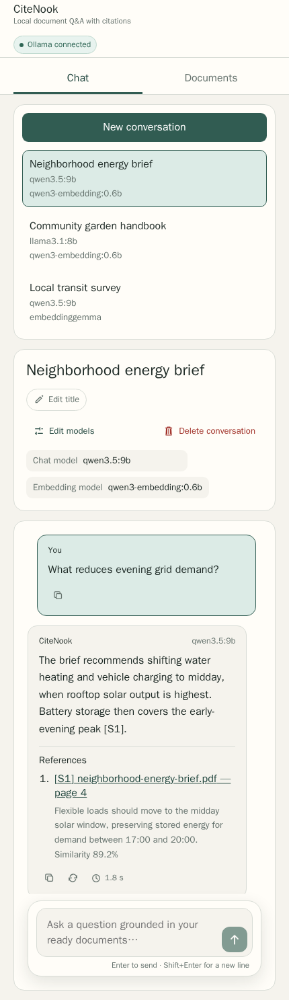

# CiteNook user guide

CiteNook is a local document question-answering application. It stores documents, indexing state, conversations, messages, model choices, and citations in the local backend so they remain available after a browser refresh or container restart.

> CiteNook has no accounts in the current release. Anyone who can open the local application can use the same stored workspace. Do not expose its ports to an untrusted network.

## 1. Start the application

Create `.env` from the checked example, configure an Ollama endpoint and installed models, then start either the external-Ollama stack or the optional Ollama Compose stack as described in the [README quick start](../README.md#quick-start).

Open `http://localhost:5173` or `http://127.0.0.1:5173`. The status in the top-right corner reports one of four conditions:

- **Checking Ollama** — CiteNook is loading its initial state.
- **Ollama connected** — the API is reachable and at least the configured model service responded.
- **Ollama unavailable** — CiteNook is running, but it cannot currently use the configured Ollama endpoint.
- **CiteNook API unavailable** — the browser cannot reach FastAPI through the local proxy. Start or repair the API service, then choose **Retry connection** in the error banner.

## 2. Add and prepare documents

Open the **Documents** tab. CiteNook accepts PDF, DOCX, TXT, and Markdown files up to the configured upload limit.

1. Choose a file.
2. Confirm the selected file name.
3. Select **Upload**.
4. Leave the worker running while the document moves from `queued` to `processing`, then to `ready` or `failed`.

A ready document can contribute passages only when **Use for answers** is active. Turning the switch off keeps the original file and its selected-backend index data but excludes it from retrieval. **Open** downloads the stored original in a new browser tab. **Delete** opens a confirmation dialog and permanently removes the document, its index data, and its ingestion jobs.

If processing fails, read the explanation below that document. Check that the file contains extractable text, that its format is supported, and that the configured embedding model is installed before uploading a corrected copy.

## 3. Create a conversation

Open **Chat** and select **New conversation**. Choose an installed chat model and embedding model. CiteNook stores both choices on the conversation:

- the chat model writes future answers;
- the embedding model must match the ready document index searched for those answers.

Use **Edit models** to change the pair for later questions. Existing messages and citations remain in the conversation. Use **Edit title** to replace the title generated from the first question.

## 4. Ask a grounded question

Select a conversation with an embedding model that matches at least one active, ready document. Enter a focused question and press Enter or the send button. Shift+Enter inserts a new line.

CiteNook searches compatible document passages and instructs the selected chat model to answer only from them. A grounded answer contains a **References** section with source identifiers such as `[S1]`, original document names, page numbers when extraction provides them, matching snippets, and similarity scores. Open a reference link to inspect the stored source.

If the retrieved passages do not support an answer, CiteNook should say that the available sources are insufficient instead of inventing a response.

## 5. Reuse and manage messages

Every message has a copy action. Assistant messages also show the server-measured response time and an action to ask the preceding question again. Retrying preserves the original turn and appends a new persisted user/assistant pair.

The complete conversation history reloads from PostgreSQL when the conversation is opened again. **Delete conversation** asks for confirmation and permanently removes that conversation and all of its messages.

The responsive layout keeps the same stored data and actions on narrow screens:

## 6. Protect local data

- `.env` is ignored by Git; keep endpoints and local configuration there.
- Uploaded originals and PostgreSQL data live in Docker named volumes by default. Ordinary `docker compose down` keeps them.
- Native and LlamaIndex deployments use separate volumes; changing backend does not migrate documents or index data.
- Do not commit exports or screenshots made from a personal workspace unless every visible file name, question, answer, citation, and model detail is safe to publish.
- The checked [screenshot gallery](screenshots/README.md) is generated from invented browser fixtures and never reads the running application or its volumes.

## Troubleshooting

- **API unavailable:** run `docker compose ps`, start the missing service, and use **Retry connection**.
- **Ollama unavailable:** verify `OLLAMA_HOST`, confirm the endpoint is reachable from the API container, and install the configured models.
- **Model disabled in a dialog:** install that exact model name or choose another configured installed model, then reload CiteNook.
- **Document stays queued:** confirm the worker is running and can reach PostgreSQL, the upload volume, and Ollama.
- **No grounded answer:** confirm at least one compatible document is both `ready` and active, then ask a question supported by its content.
- **Answer times out:** confirm Ollama is responsive, then retry or raise `OLLAMA_REQUEST_TIMEOUT_SECONDS` for slower local hardware.

See the [testing guide](testing.md) for verification commands and the [architecture guide](architecture.md) for service boundaries.
